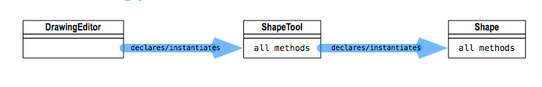
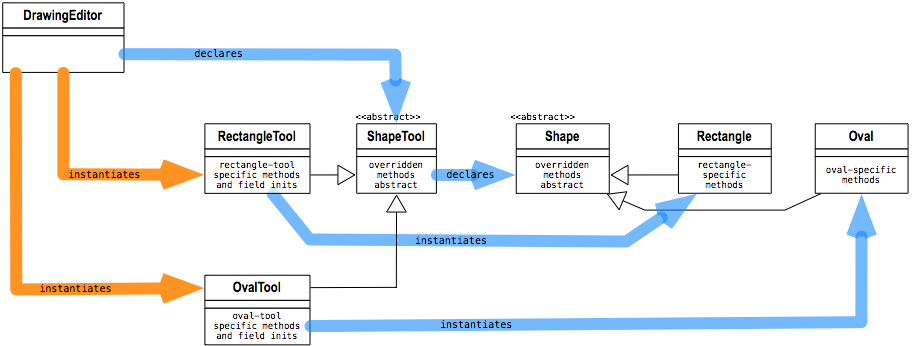
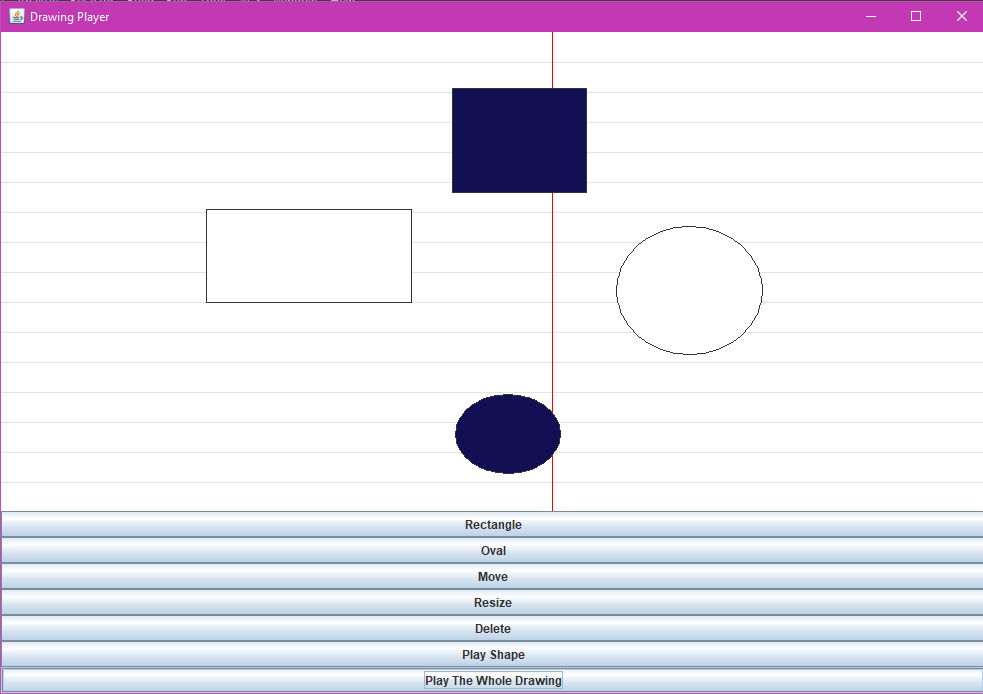

### Task :
#### Add an additional tool (and all its underlying functionality) to make an Oval tool that plays a different sound! 
### Steps  
#### 1- add a button to the tool bar, by examining how it's currently done for all the other buttons, and then duplicating that functionality.
#### 2-add a tool class that implements the new button by looking at how the ShapeTool class works
#### 3-add a class that implements the new shape by looking at how the Shape class works

#### UML Diagram At starting point :

#### UML After :

#### APP UI:

